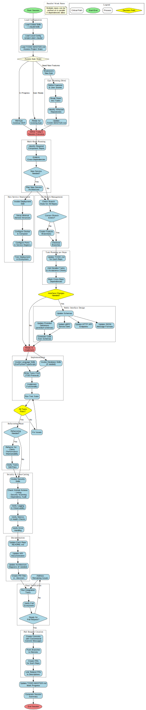
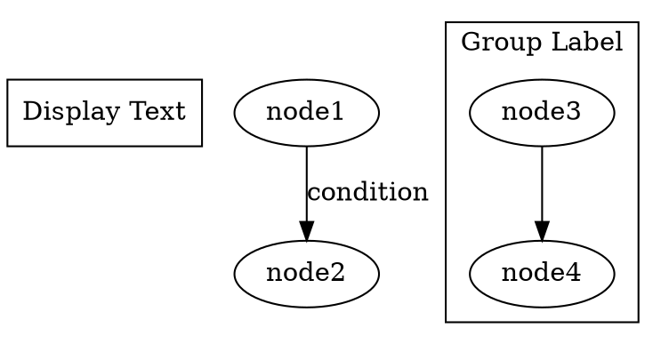
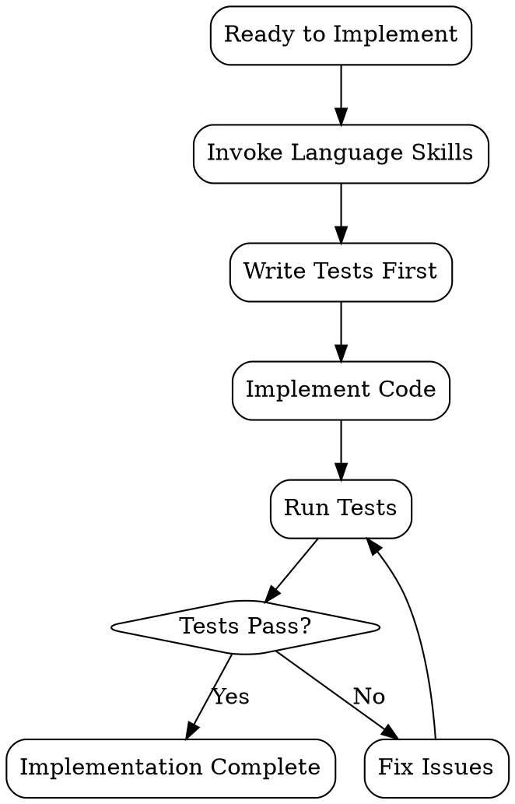

# Workflow Visualization Guide

## Overview

The Trading Ecosystem workflow is documented in three complementary formats:

1. **WORKFLOW.dot** - GraphViz DOT source file (machine-readable)
2. **WORKFLOW.svg/png/pdf** - Visual diagrams (human-readable)
3. **WORKFLOW-GUIDE.md** - Detailed narrative guide
4. **WORKFLOW-CHECKLIST.md** - Quick reference checklist

## Generating Visuals

### Prerequisites

Install GraphViz:

```bash
# Ubuntu/Debian
sudo apt-get update
sudo apt-get install graphviz

# macOS
brew install graphviz

# Windows (via Chocolatey)
choco install graphviz

# Verify installation
dot -V
```

### Generate Workflow Diagrams

```bash
# Navigate to project-plan directory
cd /home/skingham/Projects/Quantfidential/trading-ecosystem/project-plan

# Generate SVG (best for web/docs)
dot -Tsvg WORKFLOW.dot -o WORKFLOW.svg

# Generate PNG (for presentations)
dot -Tpng -Gdpi=300 WORKFLOW.dot -o WORKFLOW.png

# Generate PDF (for printing)
dot -Tpdf WORKFLOW.dot -o WORKFLOW.pdf

# Generate all formats
make workflow-diagrams  # If Makefile exists
```

### Advanced Options

**High-Resolution PNG**:
```bash
dot -Tpng -Gdpi=600 WORKFLOW.dot -o WORKFLOW-hires.png
```

**Custom Size**:
```bash
dot -Tpng -Gsize="20,30" -Gdpi=300 WORKFLOW.dot -o WORKFLOW-large.png
```

**Different Layout Algorithms**:
```bash
# Try different engines if default layout is unclear
dot -Kdot WORKFLOW.dot -Tsvg -o WORKFLOW-dot.svg      # Hierarchical (default)
dot -Kneato WORKFLOW.dot -Tsvg -o WORKFLOW-neato.svg  # Spring model
dot -Kfdp WORKFLOW.dot -Tsvg -o WORKFLOW-fdp.svg      # Force-directed
dot -Kcirco WORKFLOW.dot -Tsvg -o WORKFLOW-circo.svg  # Circular layout
```

## Viewing Diagrams

### In Browser
```bash
# Open SVG in browser
firefox WORKFLOW.svg
# or
google-chrome WORKFLOW.svg
# or
open WORKFLOW.svg  # macOS default browser
```

### In VS Code
```bash
# Install SVG extension
code --install-extension jock.svg

# Open file
code WORKFLOW.svg
```

### In Terminal (ASCII)
```bash
# Install graph-easy
sudo apt-get install libgraph-easy-perl

# Convert to ASCII art
graph-easy WORKFLOW.dot --as=ascii
```

### In Documentation Systems

**Markdown/GitHub**:
```markdown

```

**Confluence/Wiki**:
- Upload WORKFLOW.png or WORKFLOW.svg as attachment
- Embed in page

**Notion**:
- Upload WORKFLOW.png
- Drag into page

## Interactive Exploration

### VS Code GraphViz Extension

```bash
# Install extension
code --install-extension joaompinto.vscode-graphviz

# Open WORKFLOW.dot
code WORKFLOW.dot

# Press Ctrl+Shift+V (or Cmd+Shift+V on macOS) to preview
```

### Online GraphViz Viewers

1. **GraphvizOnline**: http://dreampuf.github.io/GraphvizOnline/
   - Copy/paste WORKFLOW.dot content
   - Instant visualization
   - Export as SVG/PNG

2. **GraphViz Visual Editor**: https://graphviz-visual-editor.herokuapp.com/
   - Load WORKFLOW.dot
   - Edit and visualize
   - Export multiple formats

3. **Edotor**: https://edotor.net/
   - Paste DOT code
   - Real-time preview
   - Download results

## Editing the Workflow

### DOT Language Basics



### Common Modifications

**Add New Phase**:
```dot
// Add after Phase 10
new_phase [label="New Phase\nDescription", fillcolor=lightgreen];
implementation_complete -> new_phase;
new_phase -> documentation;
```

**Add Decision Point**:
```dot
decision [label="Question?", shape=diamond, fillcolor=yellow];
previous_step -> decision;
decision -> option_a [label="Yes"];
decision -> option_b [label="No"];
```

**Add Parallel Work**:
```dot
// Use rank=same for parallel steps
{rank=same; task_a; task_b; task_c;}
start -> task_a;
start -> task_b;
start -> task_c;
task_a -> join;
task_b -> join;
task_c -> join;
```

### Regenerate After Edits

```bash
# Edit WORKFLOW.dot
vim WORKFLOW.dot

# Regenerate visuals
dot -Tsvg WORKFLOW.dot -o WORKFLOW.svg
dot -Tpng -Gdpi=300 WORKFLOW.dot -o WORKFLOW.png

# View
firefox WORKFLOW.svg
```

## Workflow Diagram Features

### Color Coding

| Color | Meaning |
|-------|---------|
| Light Green | Start/End points |
| Light Blue | Standard processes |
| Light Coral | Critical path items |
| Yellow | Decision points |
| Light Cyan | Documentation phases |
| Lavender | Multi-repo coordination |
| Light Pink | Security & quality |

### Shape Meanings

| Shape | Meaning |
|-------|---------|
| Ellipse | Start/End |
| Rectangle | Process/Action |
| Diamond | Decision Point |
| Parallelogram | Input/Output |

### Subgraph Clusters

Each dashed box represents a related group of activities:
- Configuration Loading
- Epic Planning
- Multi-Repo Planning
- Git Branch Management
- Interface Design
- Implementation
- Testing & Quality
- Security
- Documentation
- PR Creation

## Makefile Integration

Create a `Makefile` for easy diagram generation:

```makefile
# project-plan/Makefile

.PHONY: workflow-diagrams clean view

# Generate all workflow diagrams
workflow-diagrams: WORKFLOW.svg WORKFLOW.png WORKFLOW.pdf

WORKFLOW.svg: WORKFLOW.dot
	dot -Tsvg WORKFLOW.dot -o WORKFLOW.svg

WORKFLOW.png: WORKFLOW.dot
	dot -Tpng -Gdpi=300 WORKFLOW.dot -o WORKFLOW.png

WORKFLOW.pdf: WORKFLOW.dot
	dot -Tpdf WORKFLOW.dot -o WORKFLOW.pdf

# View SVG in browser
view: WORKFLOW.svg
	xdg-open WORKFLOW.svg  # Linux
	# open WORKFLOW.svg    # macOS
	# start WORKFLOW.svg   # Windows

# Clean generated files
clean:
	rm -f WORKFLOW.svg WORKFLOW.png WORKFLOW.pdf

# Validate DOT syntax
validate: WORKFLOW.dot
	dot -Tsvg WORKFLOW.dot -o /dev/null

# Generate ASCII art version
ascii: WORKFLOW.dot
	graph-easy WORKFLOW.dot --as=ascii

# Generate all formats and validate
all: validate workflow-diagrams
	@echo "All workflow diagrams generated successfully!"
```

Usage:
```bash
cd project-plan
make workflow-diagrams  # Generate all
make view              # Open in browser
make validate          # Check syntax
make ascii            # Terminal version
make clean            # Remove generated files
```

## CI/CD Integration

### GitHub Actions

```yaml
# .github/workflows/docs.yml
name: Generate Documentation

on:
  push:
    paths:
      - 'project-plan/WORKFLOW.dot'

jobs:
  generate-diagrams:
    runs-on: ubuntu-latest
    steps:
      - uses: actions/checkout@v3

      - name: Install GraphViz
        run: sudo apt-get install -y graphviz

      - name: Generate Diagrams
        run: |
          cd project-plan
          dot -Tsvg WORKFLOW.dot -o WORKFLOW.svg
          dot -Tpng -Gdpi=300 WORKFLOW.dot -o WORKFLOW.png
          dot -Tpdf WORKFLOW.dot -o WORKFLOW.pdf

      - name: Commit Diagrams
        run: |
          git config --local user.email "action@github.com"
          git config --local user.name "GitHub Action"
          git add project-plan/WORKFLOW.*
          git commit -m "docs: regenerate workflow diagrams" || exit 0
          git push
```

## Embedding in Documentation

### README.md
```markdown
# Trading Ecosystem

## Development Workflow


For detailed steps, see [Workflow Guide](./project-plan/WORKFLOW-GUIDE.md).
```

### Confluence
1. Generate WORKFLOW.png
2. Upload as attachment
3. Insert as image
4. Link to WORKFLOW-GUIDE.md

### GitHub Wiki
1. Upload WORKFLOW.svg to wiki
2. Reference: `[[images/WORKFLOW.svg]]`

### Notion
1. Upload WORKFLOW.png
2. Drag into page
3. Add link to guide below

## Customization Examples

### Focus on Specific Phase

Create a subset diagram for implementation phase:



### Simplified High-Level View


## Troubleshooting

### "dot command not found"
```bash
# Install GraphViz
sudo apt-get install graphviz  # Linux
brew install graphviz          # macOS
```

### Syntax Errors in DOT File
```bash
# Validate syntax
dot -Tsvg WORKFLOW.dot -o /dev/null

# Check for:
# - Missing semicolons
# - Unmatched braces
# - Invalid node names (use quotes for spaces)
```

### Layout Issues (Overlapping Nodes)
```bash
# Try different layout engine
dot -Kdot WORKFLOW.dot -Tsvg -o out.svg     # Hierarchical
dot -Kneato WORKFLOW.dot -Tsvg -o out.svg   # Force-directed

# Adjust node separation
# Add to DOT file:
# nodesep=1.0;  // Increase node separation
# ranksep=2.0;  // Increase rank separation
```

### Large Diagram (Hard to Read)
```bash
# Generate high-resolution version
dot -Tpng -Gdpi=600 -Gsize="30,40" WORKFLOW.dot -o WORKFLOW-large.png

# Or split into multiple diagrams (by phase)
```

## Version Control

### Track Changes
```bash
# Commit workflow changes
git add project-plan/WORKFLOW.dot
git commit -m "docs: update workflow diagram - add security phase"

# Regenerate and commit visuals
make workflow-diagrams
git add project-plan/WORKFLOW.{svg,png,pdf}
git commit -m "docs: regenerate workflow diagrams"
```

### Compare Versions
```bash
# View DOT diff
git diff HEAD~1 project-plan/WORKFLOW.dot

# Compare visual versions
git show HEAD~1:project-plan/WORKFLOW.svg > old.svg
git show HEAD:project-plan/WORKFLOW.svg > new.svg
# Open both in browser
```

## Best Practices

1. **Keep DOT Source in Git**: Always commit WORKFLOW.dot
2. **Generate Visuals in CI**: Automate diagram generation
3. **Version Large Diagrams**: Consider separate zoom-level versions
4. **Document Changes**: Update WORKFLOW-GUIDE.md when changing DOT
5. **Use Subgraphs**: Group related nodes for clarity
6. **Color Code Intentionally**: Consistent colors across all diagrams
7. **Add Legend**: Include color/shape legend in complex diagrams
8. **Test Readability**: View on different screens/sizes

## Resources

### Official Documentation
- GraphViz: https://graphviz.org/documentation/
- DOT Language: https://graphviz.org/doc/info/lang.html
- Attributes: https://graphviz.org/doc/info/attrs.html

### Tools
- VS Code GraphViz: https://marketplace.visualstudio.com/items?itemName=joaompinto.vscode-graphviz
- Online Editor: http://dreampuf.github.io/GraphvizOnline/
- Graph-Easy (ASCII): https://metacpan.org/pod/Graph::Easy

### Examples
- Gallery: https://graphviz.org/gallery/
- Cookbook: https://graphs.grevian.org/

---

**Quick Start**:
```bash
cd project-plan
dot -Tsvg WORKFLOW.dot -o WORKFLOW.svg
firefox WORKFLOW.svg
```

**Version**: 1.0 | **Date**: 2025-10-10
